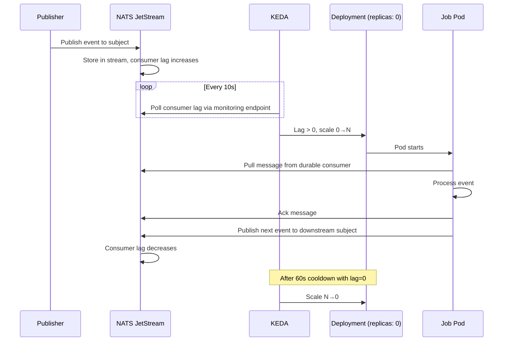

# keda-jobs

Event-driven job execution platform using NATS JetStream for messaging and KEDA for autoscaling. Jobs scale 0→N based on consumer lag and pull messages directly from JetStream.

## Youtube Demo
[](https://www.youtube.com/watch?v=FkHuq1QRRC4)

## Architecture



## Prerequisites

- Kubernetes cluster
- `kubectl` configured to access your cluster
- Docker (for building images)
- `nats` CLI (for testing)
- `make`

## Quick Start

### 1. Setup Infrastructure

```bash
# Setup everything: NATS, KEDA, namespace, and NATS streams/consumers
./k8s/setup-scripts/setup-all.sh
```

### 2. Configure Secrets

```bash
# Copy and edit the env template
cp k8s/.env.template k8s/.env
# Edit k8s/.env with your R2 credentials
```

### 3. Build and Deploy Jobs

```bash
# Build all images
make build-all

# Push to registry
make push-all

# Deploy services
kubectl apply -f jobs/image-download/service.yaml
kubectl apply -f jobs/image-resize/service.yaml
```

### 4. Test the Event Flow

```bash
# Send an image-download event via NATS CLI
nats -s localhost:4222 pub image-download '{"url":"https://picsum.photos/2000/1000"}'

# Watch logs
kubectl logs -l app=image-download -n keda-jobs-prod -f
kubectl logs -l app=image-resize -n keda-jobs-prod -f
```

## Adding New Jobs

1. Copy an existing job directory (e.g. `jobs/image-download/`) to `jobs/<yourjob>/`
2. Update the following files in your new job:
   - `main.py` — Your job logic
   - `Dockerfile` — Update the job name in `COPY` paths
   - `service.yaml` — Update names, image, consumer, and subject filter
3. Add your NATS consumer in `jobs/nats-streams-config.sh` and run it
4. Add your service to `k8s/setup-scripts/setup-app.sh` and `k8s/setup-scripts/clean-all.sh`
5. Build and deploy:
   ```bash
   make build JOB=yourjob
   make push JOB=yourjob
   kubectl apply -f jobs/yourjob/service.yaml
   ```

## CI/CD

The GitHub Actions workflow automatically:
- Detects which jobs have changed (via `atas/actions/changed-dirs`)
- Runs shared-py tests
- Builds and pushes Docker images to GHCR
- Deploys to Kubernetes on main branch merges

## Dead Letter Queue

Messages that fail all retry attempts (15 deliveries with linear backoff over ~3 days) are published to the `dead-letter` subject in the `keda-jobs-events` stream and acked so they don't block the consumer.

```bash
# View dead-letter messages
nats -s localhost:4222 stream view keda-jobs-events --subject dead-letter

# Check how many dead-letter messages exist
nats -s localhost:4222 stream info keda-jobs-events --subjects

# Replay a dead-letter message (re-publish to original subject)
nats -s localhost:4222 stream get keda-jobs-events --subject dead-letter --seq <seq_number> | jq -r '.data' | nats -s localhost:4222 pub <original-subject>
```

Each dead-letter message contains:
```json
{
  "subject": "image-download",
  "data": { "url": "https://..." },
  "num_delivered": 15
}
```

## Troubleshooting

```bash
# Check component status
cd k8s && make status

# Check NATS
kubectl logs -n nats nats-0

# List JetStream streams
nats -s localhost:4222 stream ls

# Check consumer lag
nats -s localhost:4222 consumer info keda-jobs-events image-download-consumer

# Check job logs
kubectl logs -l app=image-download -n keda-jobs-prod
kubectl logs -l app=image-resize -n keda-jobs-prod

# Check KEDA operator
kubectl logs -n keda -l app=keda-operator

# Check scaled objects
kubectl get scaledobjects -n keda-jobs-prod
```
